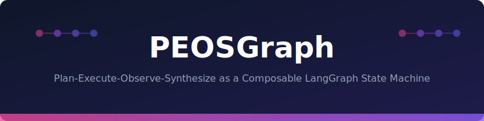
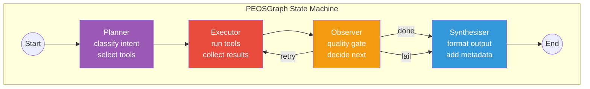

<p align="center">
  
</p>

# 🔀 PEOSGraph

[](https://www.python.org/downloads/)
[](LICENSE)
[]()
[]()

**Production-grade LangGraph implementation of the PEOS (Planner-Executor-Observer-Synthesiser) orchestration pattern for LLM agents.**

---

## 🎬 Demo

<p align="center">
  
  <br>
  <em>Query → Planner (intent + tool selection) → Executor (tool calls) → Observer (quality gate) → Synthesiser (formatted response)</em>
</p>

> **Try it yourself:** `pip install peosgraph && python examples/quickstart.py`

---

```
┌─────────────────────────────────────────────────────────────────────────┐
│                            PEOSGraph                                     │
├─────────────────────────────────────────────────────────────────────────┤
│                                                                          │
│             ┌───────────┐                                                │
│             │  START    │                                                │
│             └─────┬─────┘                                                │
│                   ▼                                                       │
│          ┌────────────────┐                                              │
│          │   PLANNER      │  Intent classification                       │
│          │   (1 LLM call) │  Tool selection                              │
│          └───────┬────────┘  Max 3-turn context window                   │
│                  │                                                        │
│         ┌────── ▼ ──────┐                                                │
│         │   EXECUTOR     │  Dynamic tool binding                         │
│    ┌───▶│   (loop ≤10)  │  Parallel execution                           │
│    │    └───────┬────────┘  Result truncation (50KB)                     │
│    │            │                                                         │
│    │     ┌──── ▼ ────┐                                                   │
│    │     │ OBSERVER   │  Quality gate                                    │
│    │     │ (decides)  │  Retry / Continue / Done                         │
│    │     └──┬─────┬───┘                                                  │
│    │        │     │                                                       │
│    └────────┘     ▼                                                       │
│            ┌──────────────┐                                              │
│            │ SYNTHESISER  │  Format response                             │
│            │ (1 LLM call) │  Quick replies (≤28 chars)                   │
│            └──────┬───────┘  Card/chart data                             │
│                   ▼                                                       │
│             ┌──────────┐                                                 │
│             │   END    │                                                 │
│             └──────────┘                                                 │
│                                                                          │
└─────────────────────────────────────────────────────────────────────────┘
```

## Why PEOSGraph?

| Problem | PEOSGraph Solution |
|---------|-------------------|
| Monolithic prompt → unpredictable behavior | **Staged prompts** — each node has a focused role |
| Token explosion in long conversations | **3-turn planner window** + history trimming |
| 200+ tools overwhelm the LLM | **Dynamic tool binding** — only bind relevant tools |
| No retry logic for failed tool calls | **Observer quality gate** with configurable retries |
| Inconsistent response formatting | **Synthesiser node** enforces output schema |

## Quick Start

```python
from peosgraph import PEOSGraph, PlannerNode, ExecutorNode, ObserverNode, SynthesiserNode

# Define your tools
tools = [search_orders, get_costs, get_confirmations]

# Build PEOS graph
graph = PEOSGraph(
    planner=PlannerNode(
        model="gpt-4o-mini",
        intent_catalog=["order_summary", "cost_analysis", "status_check"],
    ),
    executor=ExecutorNode(
        tools=tools,
        max_iterations=10,
        result_cap_bytes=50_000,
    ),
    observer=ObserverNode(
        retry_on=["tool_error", "insufficient_data"],
        max_retries=2,
    ),
    synthesiser=SynthesiserNode(
        model="gpt-4o-mini",
        output_schema={"text": str, "quick_replies": list},
    ),
)

# Run
result = await graph.invoke("What's the cost breakdown for order 4002310?")
print(result.text)
print(result.quick_replies)
```

## Features

### 🎯 Planner Node
```python
from peosgraph import PlannerNode

planner = PlannerNode(
    model="gpt-4o-mini",
    intent_catalog=["search", "detail", "action"],
    tool_groups={
        "search": ["search_orders", "search_equipment"],
        "detail": ["get_order", "get_costs", "get_confirmations"],
        "action": ["teco_order", "update_status"],
    },
    context_window=3,  # Only last 3 user turns
)

plan = await planner.plan("Show me critical orders in plant 1000")
# → Plan(intent="search", tools=["search_orders"], params={...})
```

### ⚡ Executor Node
```python
from peosgraph import ExecutorNode

executor = ExecutorNode(
    tools=tools,
    max_iterations=10,
    parallel=True,          # Execute independent tools in parallel
    result_cap_bytes=50_000, # Truncate large results
    timeout=30,             # Per-tool timeout (seconds)
)
```

### 👁️ Observer Node
```python
from peosgraph import ObserverNode, ObserverDecision

observer = ObserverNode(
    retry_on=["tool_error", "empty_result"],
    max_retries=2,
    quality_checks=[
        "has_required_fields",
        "no_error_messages",
    ],
)

decision = observer.evaluate(executor_results)
# → ObserverDecision.CONTINUE (or RETRY, DONE, FAIL)
```

### 📝 Synthesiser Node
```python
from peosgraph import SynthesiserNode

synth = SynthesiserNode(
    model="gpt-4o-mini",
    output_schema={
        "text": "str — markdown response",
        "card": "dict | None — UI card data",
        "quick_replies": "list[str] — max 28 chars each",
    },
    max_tokens=1000,
)
```

### 💾 Checkpointing
```python
# Save graph state at any point
checkpoint = graph.checkpoint()

# Resume from checkpoint (e.g., after pod restart)
result = await graph.resume(checkpoint)
```

## Architecture



## Token Optimization

| Technique | Savings | Where |
|-----------|---------|-------|
| 3-turn planner window | ~70% | PlannerNode |
| Dynamic tool binding | 60-80% | ExecutorNode |
| Result truncation (50KB) | Variable | ExecutorNode |
| History windowing (40 msgs) | Unbounded→fixed | GraphState |
| Staged prompts (no duplication) | ~40% | All nodes |

## Comparison with Alternatives

| Feature | PEOSGraph | ReAct Loop | Plan-and-Execute |
|---------|-----------|------------|------------------|
| Token efficiency | ⭐⭐⭐ | ⭐ | ⭐⭐ |
| Retry logic | Built-in (Observer) | Manual | None |
| Format consistency | Guaranteed (Synth) | Unpredictable | Variable |
| Tool selection | Dynamic binding | All tools always | Static plan |
| Checkpointing | ✅ Native | ❌ | ❌ |
| Max tools supported | 200+ | ~20 | ~50 |

## Installation

```bash
pip install peosgraph
```

## Configuration

```python
from peosgraph import PEOSConfig

config = PEOSConfig(
    planner_model="gpt-4o-mini",
    synthesiser_model="gpt-4o-mini",
    max_executor_iterations=10,
    max_observer_retries=2,
    result_cap_bytes=50_000,
    history_window=40,
    planner_context_turns=3,
    tool_timeout=30,
    llm_timeout=25,
)
```

## License

MIT

---

## ⭐ Star History

If PEOSGraph helped you build better agents — **a star helps others find it.**

[](https://star-history.com/#naveenkumarbaskaran/PEOSGraph&Date)

---

<p align="center">
  <strong>Built by <a href="https://linkedin.com/in/iamnaveenkumarb">Naveen Kumar Baskaran</a></strong>
  <br>
  <em>Senior SAP Developer & AI/ML Engineer @ SAP Labs India | PhD Candidate</em>
  <br><br>
  <a href="https://naveenkumarbaskaran.github.io/">🌐 Portfolio</a> · <a href="https://linkedin.com/in/iamnaveenkumarb">💼 LinkedIn</a> · <a href="https://twitter.com/Naveenkbaskaran">🐦 Twitter</a>
</p>
