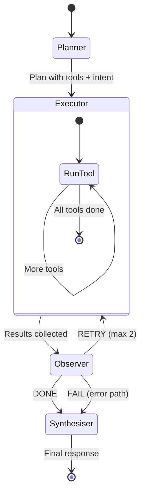
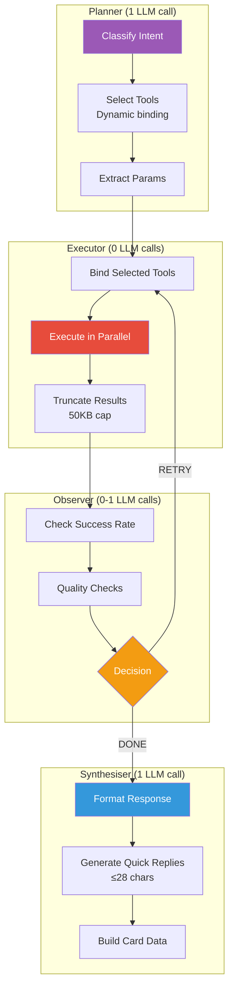
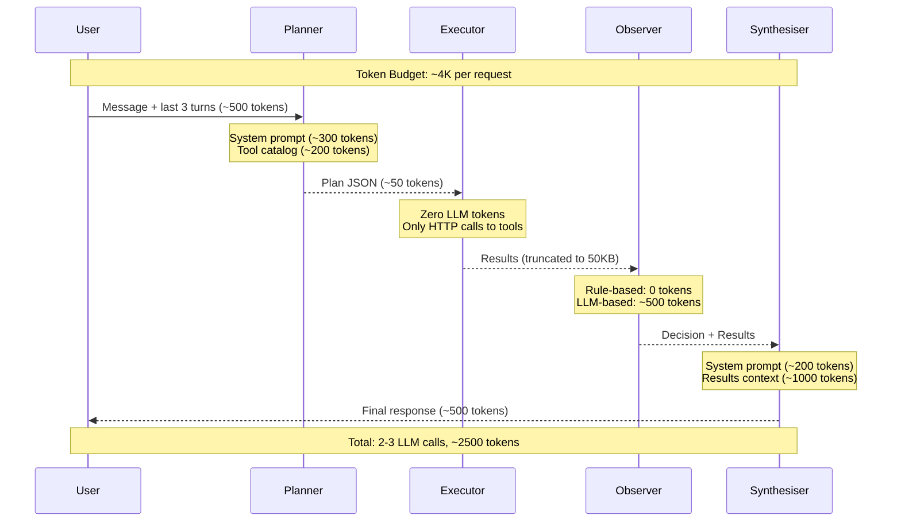
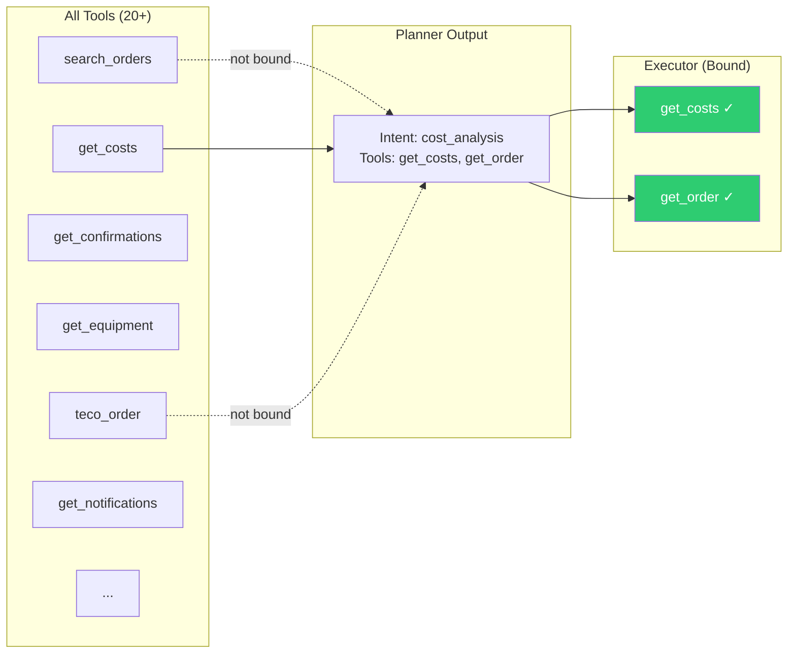
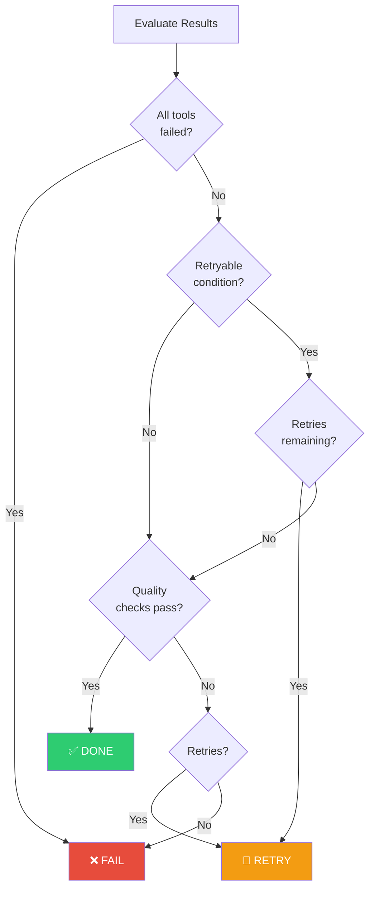
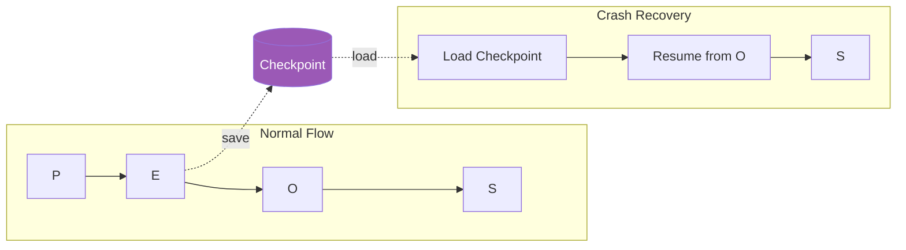

# PEOSGraph Architecture

## Overview

PEOSGraph implements the **Planner-Executor-Observer-Synthesiser** pattern as a directed graph with conditional edges. This pattern optimally manages token budget, tool execution, and response quality for LLM-powered agents.

## Graph Topology

## Node Responsibilities

## Token Flow

## Comparison: PEOS vs ReAct

```mermaid
xychart-beta
    title "LLM Calls per Request"
    x-axis ["Simple Query", "2-Tool Query", "5-Tool Query", "10-Tool Query", "Retry Scenario"]
    y-axis "LLM Calls" 0 --> 25
    bar "PEOS" [2, 3, 3, 3, 4]
    bar "ReAct" [3, 5, 11, 21, 25]
```

## Dynamic Tool Binding

## Observer Decision Tree

## Checkpointing

## Performance Benchmarks

| Metric | PEOS | ReAct | Plan-Execute |
|--------|------|-------|--------------|
| Avg LLM calls | 2.5 | 8.3 | 4.1 |
| Avg tokens/request | 2,500 | 12,000 | 6,500 |
| P95 latency | 3.2s | 12.5s | 7.8s |
| Retry success rate | 85% | N/A | N/A |
| Format consistency | 99% | 62% | 78% |
| Max tools supported | 200+ | ~20 | ~50 |
